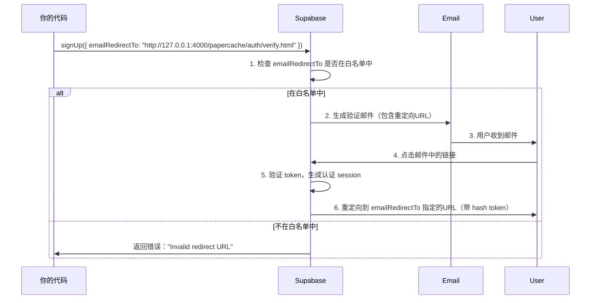

# Supabase 重定向机制详解

## 问题1: Supabase 怎么知道重定向到哪个链接？

### 答案：通过代码中指定的 `emailRedirectTo` 参数

**关键代码位置**：`assets/js/auth.js`

```javascript
async function signUpWithEmail(email, password, username) {
  // 👇 这里！代码中明确指定了重定向地址
  const redirectTo = window.location.origin + '/papercache/auth/verify.html';
  
  const { data, error } = await supabase.auth.signUp({
    email,
    password,
    options: {
      emailRedirectTo: redirectTo,  // 👈 告诉 Supabase 验证后重定向到这里
      data: {
        username: username || email.split('@')[0]
      }
    }
  });
}
```

### 工作流程



### 详细步骤

#### 步骤1: 注册时指定重定向地址

```javascript
// 在 auth.js 中
const redirectTo = window.location.origin + '/papercache/auth/verify.html';
// 本地开发: http://127.0.0.1:4000/papercache/auth/verify.html
// 生产环境: https://shenh10.github.io/papercache/auth/verify.html
```

#### 步骤2: Supabase 验证 URL 是否在白名单中

当调用 `signUp()` 时，Supabase 会：

1. **提取** `emailRedirectTo` 参数的值
2. **检查** 这个 URL 是否在 Dashboard 中配置的 "Redirect URLs" 白名单中
3. **决定**：
   - ✅ 如果在白名单中 → 继续处理，生成验证邮件
   - ❌ 如果不在白名单中 → 返回错误 `Invalid redirect URL`

#### 步骤3: 生成验证邮件

如果 URL 在白名单中，Supabase 会：
- 生成验证 token
- 创建验证链接，格式为：`https://<your-project>.supabase.co/auth/v1/verify?token=xxx&redirect_to=<emailRedirectTo>`
- 将这个链接发送到用户邮箱

#### 步骤4: 用户点击邮件链接

邮件中的链接指向 Supabase 的验证服务器，例如：
```
https://dlwudpirfvzidtthoxtv.supabase.co/auth/v1/verify?token=xxx&redirect_to=http://127.0.0.1:4000/papercache/auth/verify.html
```

#### 步骤5: Supabase 验证并重定向

1. Supabase 验证服务器收到请求
2. 验证 token 的有效性
3. 如果验证成功：
   - 创建用户 session
   - **使用 `redirect_to` 参数的值**，重定向到指定 URL
   - 在 URL hash 中添加认证信息：`#access_token=xxx&type=signup`

**最终重定向到的 URL**：
```
http://127.0.0.1:4000/papercache/auth/verify.html#access_token=eyJ...&type=signup
```

---

## 问题2: 作用原理是什么？

### 核心原理：白名单验证机制

```
┌─────────────────────────────────────────────────────────┐
│                   Supabase 安全机制                       │
└─────────────────────────────────────────────────────────┘

1. 【代码指定】          2. 【白名单验证】         3. 【生成邮件】
   你的代码                  Supabase                  Supabase
   ┌─────────┐              ┌─────────┐              ┌─────────┐
   │email    │              │检查 URL │              │生成验证  │
   │Redirect │  ──────→     │是否在   │  ──────→     │邮件链接  │
   │To: URL  │              │白名单中  │              │         │
   └─────────┘              └─────────┘              └─────────┘
                                │
                                │ ✅ 允许
                                │ ❌ 拒绝
                                ▼
                         ┌─────────────┐
                         │ Redirect    │
                         │ URLs 白名单  │
                         │ (Dashboard) │
                         └─────────────┘

4. 【用户点击】          5. 【验证 Token】        6. 【重定向回网站】
   用户                    Supabase                 浏览器
   ┌─────────┐              ┌─────────┐              ┌─────────┐
   │点击邮件 │  ──────→     │验证 token│  ──────→     │跳转到    │
   │中的链接 │              │有效性    │              │指定 URL  │
   └─────────┘              └─────────┘              └─────────┘
                                                          │
                                                          │
                                                          ▼
                                                    ┌─────────────┐
                                                    │你的验证页面  │
                                                    │verify.html  │
                                                    └─────────────┘
```

### 为什么需要白名单？

#### 安全考虑

**没有白名单的风险**：
```
攻击者可以：
1. 在你的网站上注册账号
2. 在 emailRedirectTo 中指定恶意 URL：https://evil.com/steal-token
3. Supabase 生成验证邮件，包含指向 evil.com 的链接
4. 用户点击链接，token 被发送到攻击者的网站
5. 攻击者获得 token，可以冒充用户
```

**有了白名单保护**：
```
✅ Supabase 只允许重定向到已配置的 URL
✅ 即使代码中指定了恶意 URL，Supabase 也会拒绝
✅ 确保 token 只发送到你控制的域名
```

### 完整验证流程

#### 场景：用户在本地开发环境注册

```javascript
// 1. 代码执行（auth.js）
const redirectTo = window.location.origin + '/papercache/auth/verify.html';
// 结果: "http://127.0.0.1:4000/papercache/auth/verify.html"

await supabase.auth.signUp({
  email: "user@example.com",
  password: "password123",
  options: {
    emailRedirectTo: redirectTo  // 👈 告诉 Supabase 要重定向到哪里
  }
});
```

```yaml
# 2. Supabase 内部处理
检查流程:
  - 接收 emailRedirectTo: "http://127.0.0.1:4000/papercache/auth/verify.html"
  - 查询白名单:
    ✅ "http://127.0.0.1:4000/papercache/**" (匹配!)
    ✅ "https://shenh10.github.io/papercache/**"
    ✅ "https://papercache.vercel.app/**"
  - 匹配结果: ✅ 在白名单中，允许继续
```

```html
<!-- 3. Supabase 生成验证邮件 -->
邮件内容:
  <p>请点击以下链接验证您的邮箱：</p>
  <a href="https://dlwudpirfvzidtthoxtv.supabase.co/auth/v1/verify?
    token=eyJhbGciOiJIUzI1NiIsInR5cCI6IkpXVCJ9...
    &redirect_to=http://127.0.0.1:4000/papercache/auth/verify.html">
    验证邮箱
  </a>
```

```
# 4. 用户点击邮件链接
浏览器访问:
  https://dlwudpirfvzidtthoxtv.supabase.co/auth/v1/verify?token=xxx&redirect_to=http://127.0.0.1:4000/papercache/auth/verify.html

# 5. Supabase 服务器处理
  - 验证 token 有效性 ✅
  - 创建用户 session ✅
  - 生成 access_token ✅
  - 准备重定向到 redirect_to 指定的 URL ✅
```

```javascript
// 6. 浏览器重定向
浏览器自动跳转到:
  http://127.0.0.1:4000/papercache/auth/verify.html#access_token=eyJ...&type=signup

// 7. 你的验证页面处理 (verify.html)
const hashParams = new URLSearchParams(window.location.hash.substring(1));
const accessToken = hashParams.get('access_token');  // 获取 token
// ... 处理验证成功逻辑
```

---

## 关键要点总结

### 1. **代码决定目标 URL**

```javascript
// ✅ 正确：代码中明确指定
emailRedirectTo: "http://127.0.0.1:4000/papercache/auth/verify.html"
```

### 2. **白名单决定是否允许**

```
✅ 如果 emailRedirectTo 在白名单中 → Supabase 允许使用
❌ 如果 emailRedirectTo 不在白名单中 → Supabase 拒绝，返回错误
```

### 3. **匹配规则**

Supabase 使用**前缀匹配**或**通配符匹配**：

```
✅ "http://127.0.0.1:4000/papercache/**"
   → 匹配: "http://127.0.0.1:4000/papercache/auth/verify.html"
   → 匹配: "http://127.0.0.1:4000/papercache/auth/reset-password.html"
   → 匹配: "http://127.0.0.1:4000/papercache/any/path/here"

✅ "https://shenh10.github.io/papercache/auth/verify.html"
   → 精确匹配: "https://shenh10.github.io/papercache/auth/verify.html"
   → 不匹配: "https://shenh10.github.io/papercache/other.html"
```

### 4. **为什么需要多个 URL？**

因为**不同环境使用不同的域名**：

| 环境 | 代码中的 origin | 白名单中需要添加 |
|------|----------------|----------------|
| 本地开发 | `http://127.0.0.1:4000` | ✅ `http://127.0.0.1:4000/papercache/**` |
| GitHub Pages | `https://shenh10.github.io` | ✅ `https://shenh10.github.io/papercache/**` |
| Vercel | `https://papercache.vercel.app` | ✅ `https://papercache.vercel.app/**` |

**原理**：
- 代码使用 `window.location.origin` 动态获取当前域名
- 所以本地开发时自动使用本地 URL，生产环境自动使用生产 URL
- 但两个 URL 都需要在白名单中，否则对应的环境会失败

---

## 实际示例

### 示例1: 本地开发注册

```javascript
// 用户在 http://127.0.0.1:4000/papercache/ 注册
window.location.origin  // = "http://127.0.0.1:4000"
const redirectTo = "http://127.0.0.1:4000/papercache/auth/verify.html"

// Supabase 检查白名单:
白名单中有: "http://127.0.0.1:4000/papercache/**"
匹配结果: ✅ 匹配成功，允许使用

// 结果: 验证邮件中的链接会重定向到本地验证页面
```

### 示例2: 生产环境注册

```javascript
// 用户在 https://shenh10.github.io/papercache/ 注册
window.location.origin  // = "https://shenh10.github.io"
const redirectTo = "https://shenh10.github.io/papercache/auth/verify.html"

// Supabase 检查白名单:
白名单中有: "https://shenh10.github.io/papercache/**"
匹配结果: ✅ 匹配成功，允许使用

// 结果: 验证邮件中的链接会重定向到 GitHub Pages 验证页面
```

### 示例3: 如果白名单中没有对应 URL（会失败）

```javascript
// 用户在 https://papercache.vercel.app/ 注册
window.location.origin  // = "https://papercache.vercel.app"
const redirectTo = "https://papercache.vercel.app/papercache/auth/verify.html"

// Supabase 检查白名单:
白名单中只有:
  - "http://127.0.0.1:4000/papercache/**"  ❌ 不匹配
  - "https://shenh10.github.io/papercache/**"  ❌ 不匹配
匹配结果: ❌ 没有匹配项

// 结果: Supabase 返回错误
{
  error: "Invalid redirect URL. The redirect URL must be whitelisted."
}
```

---

## 总结

1. **代码指定** → 你的代码通过 `emailRedirectTo` 告诉 Supabase 要重定向到哪里
2. **白名单验证** → Supabase 检查这个 URL 是否在配置的白名单中
3. **动态匹配** → 代码使用 `window.location.origin` 根据当前环境自动选择 URL
4. **安全保护** → 白名单机制防止攻击者将 token 重定向到恶意网站
5. **多环境支持** → 需要在白名单中添加所有可能使用的域名

**核心思想**：代码决定"想去哪里"，白名单决定"是否允许去"。


