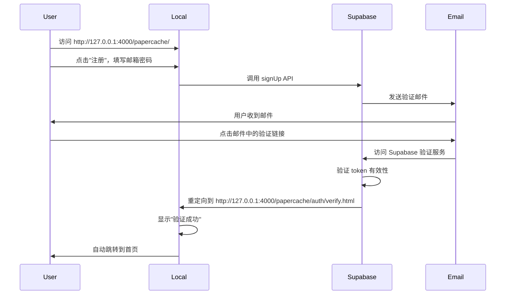
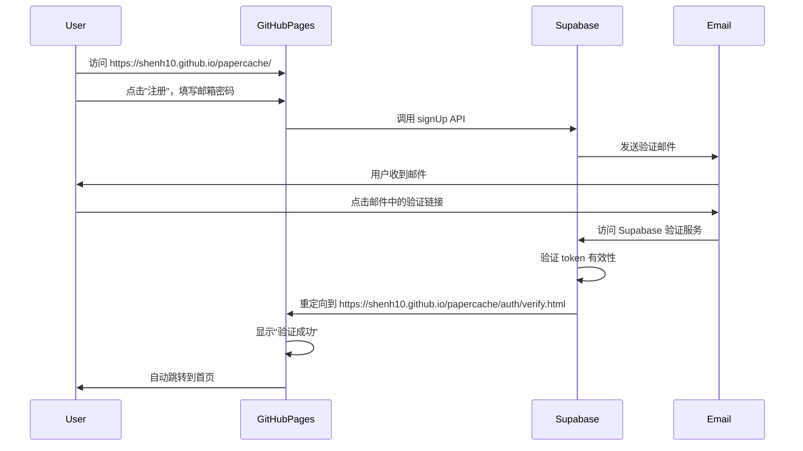

# Supabase Redirect URLs 配置说明

## 什么是 Redirect URLs？

在 Supabase Dashboard → Authentication → URL Configuration → **Redirect URLs** 中配置的 URL，是 Supabase **允许重定向回你网站的地址白名单**。

## 为什么需要配置 Redirect URLs？

当用户完成以下操作时，Supabase 需要知道可以重定向回哪些 URL：

1. **邮箱验证**：用户点击邮箱中的验证链接后
2. **密码重置**：用户重置密码后
3. **OAuth 登录**：通过 GitHub/Google 等第三方登录后
4. **魔法链接登录**：通过邮箱魔法链接登录后

如果目标 URL 不在白名单中，Supabase 会**拒绝重定向**，并返回错误。

## 三个 URL 的具体作用

### 1. `http://127.0.0.1:4000/papercache/auth/verify.html`（本地开发）

**环境**：本地开发环境

**效果**：
- ✅ 允许本地 Jekyll 服务器（`bundle exec jekyll serve`）接收验证回调
- ✅ 本地开发时，用户点击验证邮件后，会重定向到这个地址
- ✅ 适合在本地测试邮箱验证、注册等功能

**使用场景**：
```bash
# 在本地启动开发服务器
bundle exec jekyll serve --config _config.yml,_config_local.yml

# 访问 http://127.0.0.1:4000/papercache/
# 注册新用户 → 收到验证邮件 → 点击链接 → 重定向到本地验证页面
```

**注意**：
- 这个 URL **只在本地开发时有效**
- 生产环境的用户**无法**使用这个 URL（因为 `127.0.0.1` 是本地回环地址）

---

### 2. `https://shenh10.github.io/papercache/auth/verify.html`（GitHub Pages 生产环境）

**环境**：GitHub Pages 部署的生产环境

**效果**：
- ✅ 允许 GitHub Pages 网站接收验证回调
- ✅ 通过 GitHub Actions 部署到 `shenh10.github.io/papercache` 的用户，点击验证邮件后会重定向到这里
- ✅ 这是你的**主要生产环境**

**使用场景**：
```
用户访问 https://shenh10.github.io/papercache/
→ 注册新账号
→ 收到验证邮件（链接指向这个 URL）
→ 点击邮件中的链接
→ Supabase 验证 token
→ 重定向到 https://shenh10.github.io/papercache/auth/verify.html
→ 显示"验证成功"，然后跳转到首页
```

**配置位置**：
- GitHub Pages 通过 `.github/workflows/deploy-pages.yml` 自动部署
- 使用 GitHub Secrets 中的 `SUPABASE_URL` 和 `SUPABASE_ANON_KEY`

---

### 3. `https://papercache.vercel.app/auth/verify.html`（Vercel 部署环境）

**环境**：Vercel 部署的生产环境

**效果**：
- ✅ 允许 Vercel 部署的网站接收验证回调
- ✅ 如果你在 Vercel 上也部署了网站（通常是用于 API 或其他用途）
- ✅ 这是你的**备用/API 服务器环境**

**使用场景**：
```
如果你：
1. 使用 Vercel 部署网站（除了 GitHub Pages）
2. 或者使用 Vercel 部署 API Functions
3. 需要让 Vercel 部署的网站也能处理用户验证

那么用户访问 Vercel 部署的网站时，验证流程会重定向到这里
```

**是否需要配置？**
- ✅ **如果只使用 GitHub Pages**：可以**不添加**这个 URL
- ✅ **如果同时使用 Vercel 部署**：建议添加，以支持 Vercel 环境下的用户验证

---

## 配置建议

### 方案一：最小配置（推荐）

如果你**只使用 GitHub Pages**：

```
✅ https://shenh10.github.io/papercache/**
✅ http://127.0.0.1:4000/papercache/**
```

**说明**：
- 使用通配符 `**` 可以匹配所有子路径
- 不需要添加具体的 `verify.html`，因为 `/**` 已经包含了所有路径

### 方案二：完整配置

如果你**同时使用多个部署环境**：

```
✅ https://shenh10.github.io/papercache/**
✅ http://127.0.0.1:4000/papercache/**
✅ https://papercache.vercel.app/**
```

### 方案三：精确配置（更安全）

如果你想要**更严格的安全控制**（只允许特定页面）：

```
✅ https://shenh10.github.io/papercache/auth/verify.html
✅ https://shenh10.github.io/papercache/auth/reset-password.html
✅ http://127.0.0.1:4000/papercache/auth/verify.html
✅ http://127.0.0.1:4000/papercache/auth/reset-password.html
```

**优点**：更安全，只允许特定页面接收重定向  
**缺点**：需要为每个需要验证的页面单独配置

---

## 安全注意事项

### ✅ 应该做：
1. **只添加你控制的域名**：不要添加第三方域名
2. **使用 HTTPS**（生产环境）：确保数据安全传输
3. **使用通配符**（如果适用）：简化配置，匹配所有子路径

### ❌ 不应该做：
1. **不要添加未验证的域名**：防止恶意重定向
2. **不要在 URL 中包含 token**：URL 本身应该是干净的，token 在 hash 中
3. **不要暴露内部 IP**：生产环境不要使用 `127.0.0.1`

---

## 实际效果演示

### 本地开发流程：



### 生产环境流程：



---

## 常见问题

### Q: 如果不配置 Redirect URLs 会怎样？

**A:** Supabase 会拒绝重定向，用户在点击验证邮件后会看到错误信息：
```
Invalid redirect URL. The redirect URL must be whitelisted.
```

### Q: 可以使用通配符吗？

**A:** 可以！Supabase 支持通配符：
- `https://shenh10.github.io/papercache/**` - 匹配所有子路径
- `https://shenh10.github.io/**` - 匹配整个域名的所有路径

### Q: 需要为每个环境都配置吗？

**A:** 只配置你**实际使用**的环境：
- ✅ 本地开发：需要
- ✅ 主要生产环境（GitHub Pages）：需要
- ❓ 备用环境（Vercel）：如果使用则配置，否则不需要

### Q: 这些 URL 是公开的吗？

**A:** 是的，这些 URL 是公开的。但这是**正常的**：
- 验证页面本身是公开的
- 安全性依赖于 URL hash 中的 token（只有用户能看到）
- Supabase 会验证 token 的有效性

---

## 总结

| URL | 环境 | 必需性 | 效果 |
|-----|------|--------|------|
| `http://127.0.0.1:4000/papercache/**` | 本地开发 | ✅ 必需 | 允许本地测试验证流程 |
| `https://shenh10.github.io/papercache/**` | GitHub Pages | ✅ 必需 | 主要生产环境，大部分用户使用 |
| `https://papercache.vercel.app/**` | Vercel | ⚠️ 可选 | 如果使用 Vercel 部署则需要 |

**推荐配置**：至少添加前两个 URL（使用通配符 `**`），这样可以支持所有子路径，包括未来的新页面。


